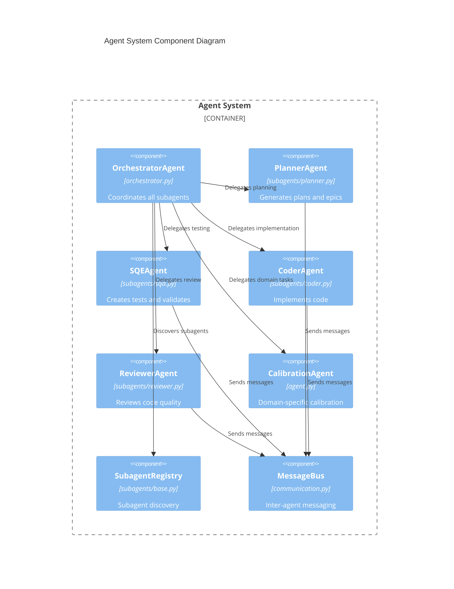

# Agentic System Next Steps Roadmap

## Executive Summary

This document outlines the investigation findings and concrete next steps for enhancing the agentic AI capabilities of the Pt/Pd Calibration Studio. Based on analysis of the current codebase against a multi-agent development template, this roadmap follows C4 architecture principles and Agile milestones.

---

## Current State Analysis

### What Exists (Strengths)

| Component | Status | Implementation | Notes |
|-----------|--------|----------------|-------|
| **CalibrationAgent** | Complete | `agents/agent.py` | ReAct-style reasoning loop |
| **Tool System** | Complete | `agents/tools.py` | 8 calibration tools, extensible registry |
| **Memory System** | Complete | `agents/memory.py` | Tiered: long-term + working memory |
| **Planning System** | Complete | `agents/planning.py` | Template-based with adaptation |
| **LLM Clients** | Complete | `llm/client.py` | Anthropic + OpenAI providers |
| **CalibrationAssistant** | Complete | `llm/assistant.py` | High-level chat interface |
| **PlatinumPalladiumAI** | Complete | `ai/platinum_palladium_ai.py` | 6 analysis capabilities |
| **Configuration** | Complete | `config.py` | Pydantic-settings based |
| **C4 Architecture** | Partial | `ARCHITECTURE.md` | Levels 1-3 documented |

### What's Missing (Gaps)

| Gap | Priority | Impact | Template Reference |
|-----|----------|--------|-------------------|
| **Unit Tests for Agents** | Critical | Cannot safely iterate | SQE subagent |
| **Multi-Agent Orchestration** | High | No task delegation | Orchestrator subagent |
| **Specialized Subagents** | High | No Planner/SQE/Coder/Reviewer | Core Principles |
| **Structured Logging** | Medium | No JSON observability | Observable principle |
| **Performance Metrics** | Medium | No agent effectiveness tracking | Self-healing principle |
| **Circuit Breakers** | Medium | No graceful degradation | Self-healing principle |
| **Learning from Failures** | Low | No outcome-based adaptation | Test-first principle |

---

## Project Context

```
PROJECT_NAME: Pt/Pd Calibration Studio
DOMAIN: AI-powered calibration system (web app)
GOAL: Enhance agentic capabilities for autonomous calibration assistance
CONSTRAINTS: Python 3.10+, Gradio UI, existing ReAct architecture
```

---

## Milestone 1: Foundation - Testing & Stability

**Goal:** Establish test coverage foundation with SQE patterns. Target: 80%+ coverage for agents module.

### Epic 1.1: Agent Core Testing

| Story | Description | Subagent | Acceptance Criteria |
|-------|-------------|----------|---------------------|
| 1.1.1 | Unit tests for CalibrationAgent | SQE | `pytest tests/unit/test_agent.py` passes; covers `run()`, `_think_and_act()`, `_execute_action()`, `_reflect()` |
| 1.1.2 | Unit tests for ReasoningStep | SQE | All step types tested; serialization verified |
| 1.1.3 | Unit tests for AgentConfig | SQE | All config combinations validated |

**Definition of Done:**
- [ ] 90%+ line coverage for `agents/agent.py`
- [ ] All async methods tested with `pytest-asyncio`
- [ ] Mock LLM responses for deterministic tests
- [ ] Edge cases: timeout, malformed JSON, empty responses

### Epic 1.2: Tool System Testing

| Story | Description | Subagent | Acceptance Criteria |
|-------|-------------|----------|---------------------|
| 1.2.1 | Unit tests for ToolRegistry | SQE | Registration, lookup, listing all tested |
| 1.2.2 | Unit tests for each Tool | SQE | All 8 tools individually tested |
| 1.2.3 | Integration test: Agent + Tools | SQE | End-to-end tool execution verified |

**Definition of Done:**
- [ ] 90%+ coverage for `agents/tools.py`
- [ ] ToolResult success/error paths tested
- [ ] Tool parameter validation tested

### Epic 1.3: Memory System Testing

| Story | Description | Subagent | Acceptance Criteria |
|-------|-------------|----------|---------------------|
| 1.3.1 | Unit tests for AgentMemory | SQE | `remember()`, `recall()`, `forget()` tested |
| 1.3.2 | Test memory persistence | SQE | JSON save/load cycle verified |
| 1.3.3 | Test working memory | SQE | Sliding window behavior verified |
| 1.3.4 | Test auto-pruning | SQE | Max items limit enforced |

**Definition of Done:**
- [ ] 90%+ coverage for `agents/memory.py`
- [ ] Importance scoring algorithm tested
- [ ] Category indexing verified

### Epic 1.4: Planning System Testing

| Story | Description | Subagent | Acceptance Criteria |
|-------|-------------|----------|---------------------|
| 1.4.1 | Unit tests for Plan | SQE | Status transitions tested |
| 1.4.2 | Unit tests for Planner | SQE | Template matching, adaptation tested |
| 1.4.3 | Test plan dependency resolution | SQE | Parallel/sequential execution verified |

**Definition of Done:**
- [ ] 90%+ coverage for `agents/planning.py`
- [ ] All PlanStatus enum values tested
- [ ] Adaptation history tracking verified

---

## Milestone 2: Core Implementation - Multi-Agent Architecture

**Goal:** Implement specialized subagents following the template's multi-agent pattern.

### Epic 2.1: Subagent Base Infrastructure

| Story | Description | Subagent | Acceptance Criteria |
|-------|-------------|----------|---------------------|
| 2.1.1 | Create `BaseSubagent` abstract class | Coder | Abstract methods: `run()`, `capabilities()`, `tools()` |
| 2.1.2 | Implement subagent registry | Coder | Dynamic subagent discovery and registration |
| 2.1.3 | Add subagent communication protocol | Coder | Message passing between subagents |

**Definition of Done:**
- [ ] `agents/subagents/base.py` created
- [ ] `SubagentRegistry` class implemented
- [ ] Message protocol: `SubagentMessage` Pydantic model

### Epic 2.2: Planner Subagent

| Story | Description | Subagent | Acceptance Criteria |
|-------|-------------|----------|---------------------|
| 2.2.1 | Implement PlannerAgent | Coder | Generates C4-aligned architecture plans |
| 2.2.2 | Add epic/story decomposition | Coder | Breaks goals into epics with AC |
| 2.2.3 | Unit tests for PlannerAgent | SQE | Plan generation tested |

**File:** `agents/subagents/planner.py`

**Definition of Done:**
- [ ] Can generate multi-step plans with dependencies
- [ ] Outputs structured YAML/JSON plans
- [ ] Each story has Definition of Done

### Epic 2.3: SQE (Software Quality Engineer) Subagent

| Story | Description | Subagent | Acceptance Criteria |
|-------|-------------|----------|---------------------|
| 2.3.1 | Implement SQEAgent | Coder | Generates test plans from stories |
| 2.3.2 | Add test case generation | Coder | Creates pytest test cases |
| 2.3.3 | Implement validation runner | Coder | Executes and reports test results |
| 2.3.4 | Unit tests for SQEAgent | SQE | Test generation validated |

**File:** `agents/subagents/sqa.py`

**Definition of Done:**
- [ ] Generates pytest-compatible test files
- [ ] Includes edge cases and mocks
- [ ] Reports coverage metrics

### Epic 2.4: Coder Subagent

| Story | Description | Subagent | Acceptance Criteria |
|-------|-------------|----------|---------------------|
| 2.4.1 | Implement CoderAgent | Coder | Generates code from specifications |
| 2.4.2 | Add code review capability | Coder | Self-reviews generated code |
| 2.4.3 | Implement refactoring tools | Coder | Can modularize and improve code |
| 2.4.4 | Unit tests for CoderAgent | SQE | Code generation validated |

**File:** `agents/subagents/coder.py`

**Definition of Done:**
- [ ] Follows project coding conventions (CLAUDE.md)
- [ ] Generates type-hinted Python code
- [ ] Includes docstrings and error handling

### Epic 2.5: Reviewer Subagent

| Story | Description | Subagent | Acceptance Criteria |
|-------|-------------|----------|---------------------|
| 2.5.1 | Implement ReviewerAgent | Coder | Reviews code against standards |
| 2.5.2 | Add security analysis | Coder | Detects OWASP top 10 issues |
| 2.5.3 | Implement feedback formatting | Coder | Actionable, categorized feedback |
| 2.5.4 | Unit tests for ReviewerAgent | SQE | Review quality validated |

**File:** `agents/subagents/reviewer.py`

**Definition of Done:**
- [ ] Identifies code smells and improvements
- [ ] Categorizes issues: critical, warning, info
- [ ] Provides fix suggestions

---

## Milestone 3: Orchestration & Integration

**Goal:** Implement orchestration layer for multi-agent coordination.

### Epic 3.1: Orchestrator Implementation

| Story | Description | Subagent | Acceptance Criteria |
|-------|-------------|----------|---------------------|
| 3.1.1 | Implement OrchestratorAgent | Coder | Coordinates subagent execution |
| 3.1.2 | Add task queue management | Coder | Parallel/dependent task handling |
| 3.1.3 | Implement state persistence | Coder | Multi-session continuity |
| 3.1.4 | Unit tests for Orchestrator | SQE | Coordination logic validated |

**File:** `agents/orchestrator.py`

**Definition of Done:**
- [ ] Can delegate to Planner, SQE, Coder, Reviewer
- [ ] Handles subagent failures gracefully
- [ ] Tracks overall progress

### Epic 3.2: Agent-to-Agent Communication

| Story | Description | Subagent | Acceptance Criteria |
|-------|-------------|----------|---------------------|
| 3.2.1 | Define message protocol | Coder | Pydantic models for agent messages |
| 3.2.2 | Implement message bus | Coder | Async message passing |
| 3.2.3 | Add conversation history | Coder | Cross-agent context sharing |
| 3.2.4 | Integration tests | SQE | Multi-agent scenarios tested |

**Definition of Done:**
- [ ] Agents can request/respond to each other
- [ ] Message history preserved
- [ ] Deadlock prevention implemented

### Epic 3.3: Workflow Integration

| Story | Description | Subagent | Acceptance Criteria |
|-------|-------------|----------|---------------------|
| 3.3.1 | Integrate with existing CalibrationAgent | Coder | Backward compatible |
| 3.3.2 | Add UI for agent orchestration | Coder | Gradio tab for agent control |
| 3.3.3 | API endpoints for orchestration | Coder | REST API for external access |
| 3.3.4 | E2E tests | SQE | Full workflow validated |

**Definition of Done:**
- [ ] Existing CalibrationAssistant still works
- [ ] New orchestrator accessible via UI
- [ ] API documented with OpenAPI

---

## Milestone 4: Observability & Production Readiness

**Goal:** Add monitoring, logging, and production features.

### Epic 4.1: Structured Logging

| Story | Description | Subagent | Acceptance Criteria |
|-------|-------------|----------|---------------------|
| 4.1.1 | Implement JSON structured logging | Coder | All agent actions logged as JSON |
| 4.1.2 | Add trace IDs | Coder | Request correlation across agents |
| 4.1.3 | Implement log aggregation | Coder | Centralized log collection |

**Definition of Done:**
- [ ] Logs include: timestamp, agent_id, action, result, duration
- [ ] Trace IDs propagate across subagents
- [ ] Log levels: DEBUG, INFO, WARN, ERROR

### Epic 4.2: Metrics & Monitoring

| Story | Description | Subagent | Acceptance Criteria |
|-------|-------------|----------|---------------------|
| 4.2.1 | Add agent performance metrics | Coder | Success rate, latency, token usage |
| 4.2.2 | Implement health checks | Coder | `/health` endpoint for agents |
| 4.2.3 | Add circuit breakers | Coder | Graceful degradation on LLM failures |

**Definition of Done:**
- [ ] Metrics exportable (Prometheus format)
- [ ] Health checks detect: LLM connectivity, memory limits
- [ ] Circuit breaker: 3 failures = open, 30s cooldown

### Epic 4.3: CI/CD Integration

| Story | Description | Subagent | Acceptance Criteria |
|-------|-------------|----------|---------------------|
| 4.3.1 | Update GitHub Actions | Orchestrator | Agent tests in CI pipeline |
| 4.3.2 | Add coverage requirements | Orchestrator | 80% minimum for agents |
| 4.3.3 | Performance benchmarks | Orchestrator | Regression detection |

**Definition of Done:**
- [ ] All agent tests run on PR
- [ ] Coverage badge for agents module
- [ ] Benchmark results tracked

---

## Architecture Updates

### C4 Level 4: Code (Proposed)



### Proposed Directory Structure

```
src/ptpd_calibration/agents/
├── __init__.py              # Public exports
├── agent.py                 # CalibrationAgent (existing)
├── memory.py                # AgentMemory (existing)
├── planning.py              # Plan, Planner (existing)
├── tools.py                 # ToolRegistry (existing)
├── orchestrator.py          # NEW: OrchestratorAgent
├── communication.py         # NEW: MessageBus, protocols
├── metrics.py               # NEW: Performance tracking
└── subagents/
    ├── __init__.py
    ├── base.py              # NEW: BaseSubagent, registry
    ├── planner.py           # NEW: PlannerAgent
    ├── sqa.py               # NEW: SQEAgent
    ├── coder.py             # NEW: CoderAgent
    └── reviewer.py          # NEW: ReviewerAgent
```

---

## Implementation Priority

### Phase 1: Critical (Week 1-2)
1. **Epic 1.1-1.4**: Full test coverage for existing agents
2. **Epic 2.1**: Subagent base infrastructure

### Phase 2: High (Week 3-4)
1. **Epic 2.2-2.5**: Implement all subagents
2. **Epic 3.1**: Orchestrator implementation

### Phase 3: Medium (Week 5-6)
1. **Epic 3.2-3.3**: Communication and integration
2. **Epic 4.1-4.2**: Observability

### Phase 4: Enhancement (Week 7+)
1. **Epic 4.3**: CI/CD integration
2. Performance optimization
3. Learning from outcomes

---

## Quick Start Commands

```bash
# Run existing agent tests (when created)
PYTHONPATH=src pytest tests/unit/test_agent*.py -v

# Run with coverage
PYTHONPATH=src pytest tests/unit/ --cov=src/ptpd_calibration/agents --cov-report=term-missing

# Type check agents
mypy src/ptpd_calibration/agents --ignore-missing-imports

# Lint agents
ruff check src/ptpd_calibration/agents
```

---

## Success Metrics

| Metric | Target | Current |
|--------|--------|---------|
| Agent module test coverage | 90% | ~5% |
| Subagent count | 5 (Planner, SQE, Coder, Reviewer, Orchestrator) | 1 (CalibrationAgent) |
| Tool count | 15+ | 8 |
| API endpoints for agents | 5+ | 3 |
| Documentation completeness | 100% | 60% |

---

## References

- [CLAUDE.md](./CLAUDE.md) - Project coding conventions
- [ARCHITECTURE.md](./ARCHITECTURE.md) - C4 architecture diagrams
- [agents/__init__.py](./src/ptpd_calibration/agents/__init__.py) - Current exports
- Template: Universal Dev Agent prompt template

---

*Generated: 2026-02-01*
*Status: Investigation Complete*
