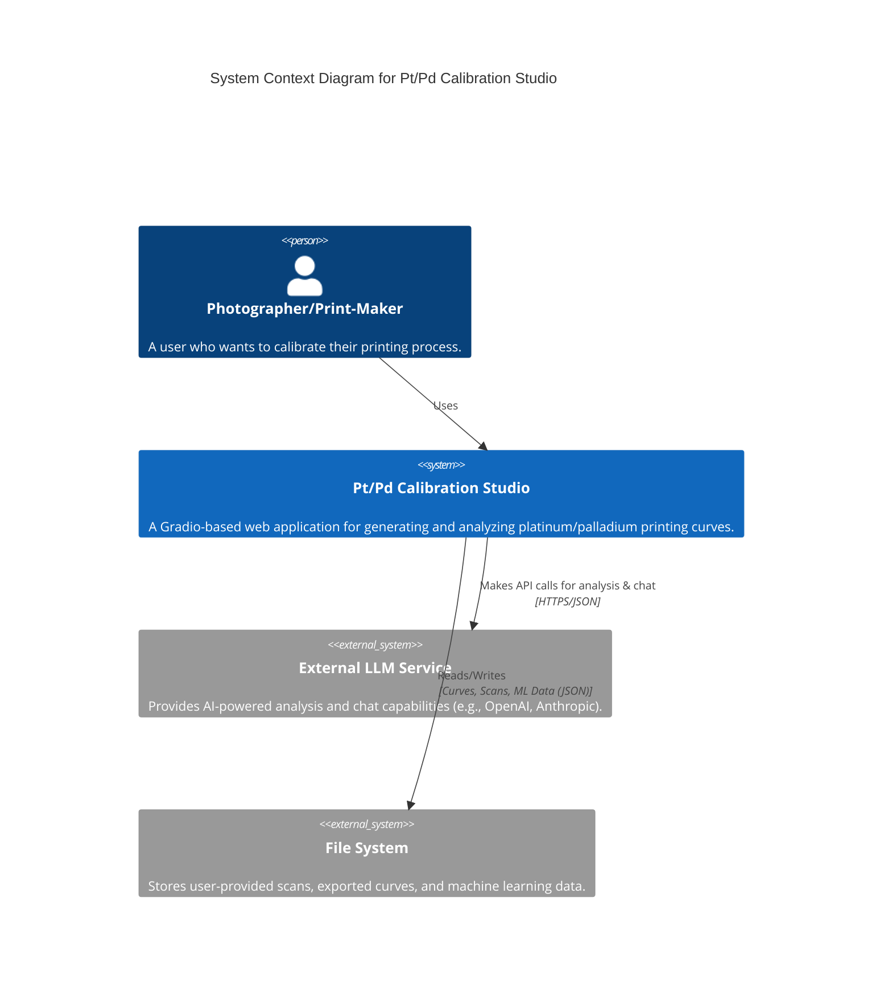
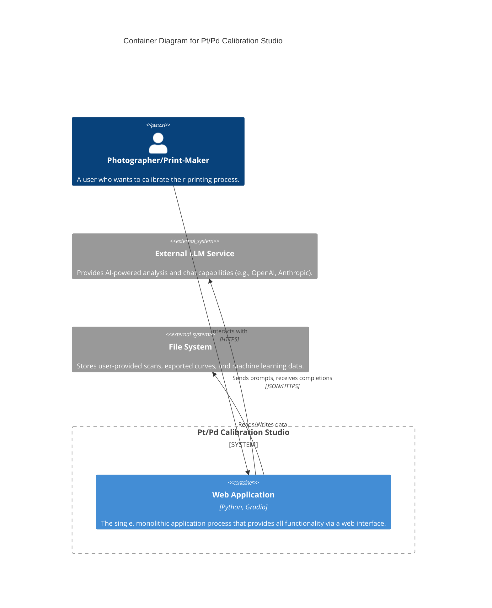
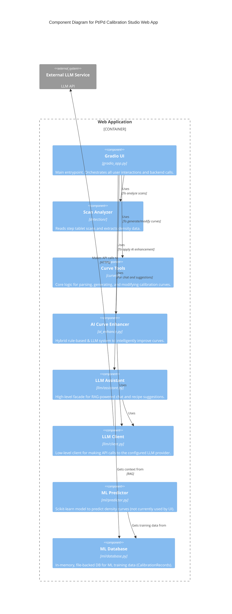

# Pt/Pd Calibration Studio - C4 Architecture

This document outlines the architecture of the Pt/Pd Calibration Studio application using the C4 model.

## Level 1: System Context

This diagram shows the high-level context, including the users and external systems interacting with your application.



## Level 2: Containers

This diagram zooms into the system to show the main containers. In this case, the application is a single monolithic process.



## Level 3: Components

This diagram breaks down the "Web Application" container into its major internal components and shows how they interact.



## Level 4: Agent System (Code)

This diagram details the Agent System component, showing the multi-agent architecture with specialized subagents, orchestration, and infrastructure.

```mermaid
C4Component
  title Agent System Component Diagram (Level 4)

  Container_Boundary(agents, "Agent System (src/ptpd_calibration/agents/)") {
    Component(orchestrator, "OrchestratorAgent", "orchestrator.py (572 LOC)", "Coordinates all subagents, manages workflows with parallel/sequential execution")
    Component(calibration, "CalibrationAgent", "agent.py (383 LOC)", "ReAct-style reasoning loop for domain-specific calibration tasks")

    Component_Boundary(subagents, "Specialized Subagents (subagents/)") {
      Component(planner, "PlannerAgent", "planner.py (403 LOC)", "C4-aligned planning, epic/story decomposition, acceptance criteria")
      Component(sqa, "SQEAgent", "sqa.py (503 LOC)", "Test plan generation, pytest code generation, validation")
      Component(coder, "CoderAgent", "coder.py (518 LOC)", "Code generation following CLAUDE.md conventions")
      Component(reviewer, "ReviewerAgent", "reviewer.py (555 LOC)", "Code review with scoring, OWASP security analysis")
    }

    Component_Boundary(infra, "Infrastructure") {
      Component(bus, "MessageBus", "communication.py (473 LOC)", "Priority-based inter-agent messaging")
      Component(registry, "SubagentRegistry", "subagents/base.py (528 LOC)", "Dynamic subagent discovery and registration")
      Component(logging, "StructuredLogger", "logging.py (543 LOC)", "JSON logging with OpenTelemetry-inspired trace IDs")
    }

    Component_Boundary(state, "State Management") {
      Component(memory, "AgentMemory", "memory.py (315 LOC)", "Tiered memory: long-term (1K items) + working memory")
      Component(planning, "PlanEngine", "planning.py (273 LOC)", "Task decomposition with adaptation tracking")
      Component(tools, "ToolRegistry", "tools.py (627 LOC)", "10+ calibration tools with Anthropic format conversion")
    }

    Rel(orchestrator, planner, "Delegates planning")
    Rel(orchestrator, sqa, "Delegates testing")
    Rel(orchestrator, coder, "Delegates implementation")
    Rel(orchestrator, reviewer, "Delegates review")
    Rel(orchestrator, calibration, "Delegates domain tasks")
    Rel(orchestrator, bus, "Sends messages")
    Rel(orchestrator, registry, "Discovers subagents")

    Rel(calibration, tools, "Executes tools")
    Rel(calibration, memory, "Stores/recalls context")
    Rel(calibration, planning, "Manages task plans")

    Rel(bus, logging, "Logs all messages")
  }
```

### Agent System Summary

| Component | Lines of Code | Purpose |
|-----------|---------------|---------|
| **OrchestratorAgent** | 572 | Multi-agent workflow coordination |
| **CalibrationAgent** | 383 | ReAct reasoning with tools |
| **PlannerAgent** | 403 | C4-aligned planning |
| **SQEAgent** | 503 | Test generation |
| **CoderAgent** | 518 | Code implementation |
| **ReviewerAgent** | 555 | Code review |
| **MessageBus** | 473 | Inter-agent communication |
| **BaseSubagent** | 528 | Subagent infrastructure |
| **StructuredLogger** | 543 | JSON logging |
| **AgentMemory** | 315 | Tiered memory system |
| **PlanEngine** | 273 | Task planning |
| **ToolRegistry** | 627 | Tool management |
| **Total** | **6,155** | Production-ready agent system |
