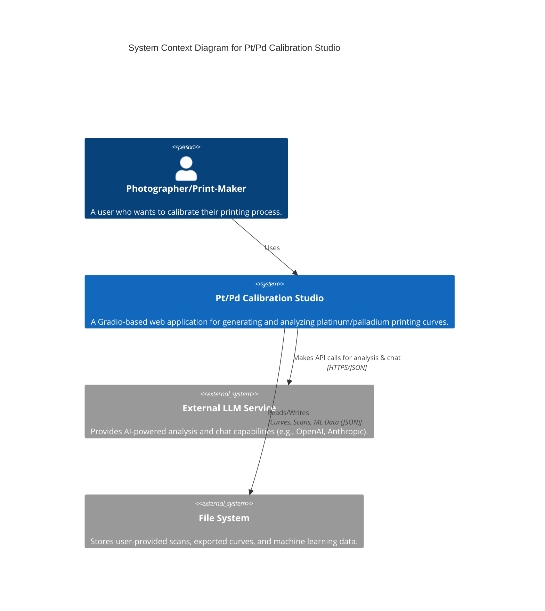
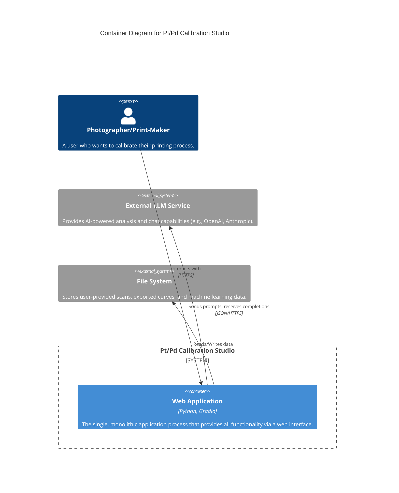
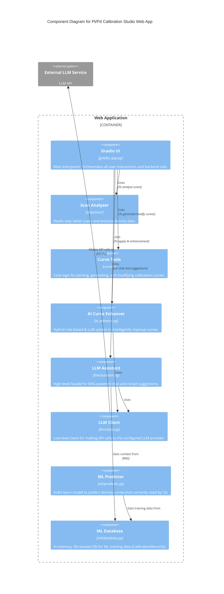

# Pt/Pd Calibration Studio - C4 Architecture

This document outlines the architecture of the Pt/Pd Calibration Studio application using the C4 model.

## Level 1: System Context

This diagram shows the high-level context, including the users and external systems interacting with your application.

## Level 2: Containers

This diagram zooms into the system to show the main containers. In this case, the application is a single monolithic process.

## Level 3: Components

This diagram breaks down the "Web Application" container into its major internal components and shows how they interact.

